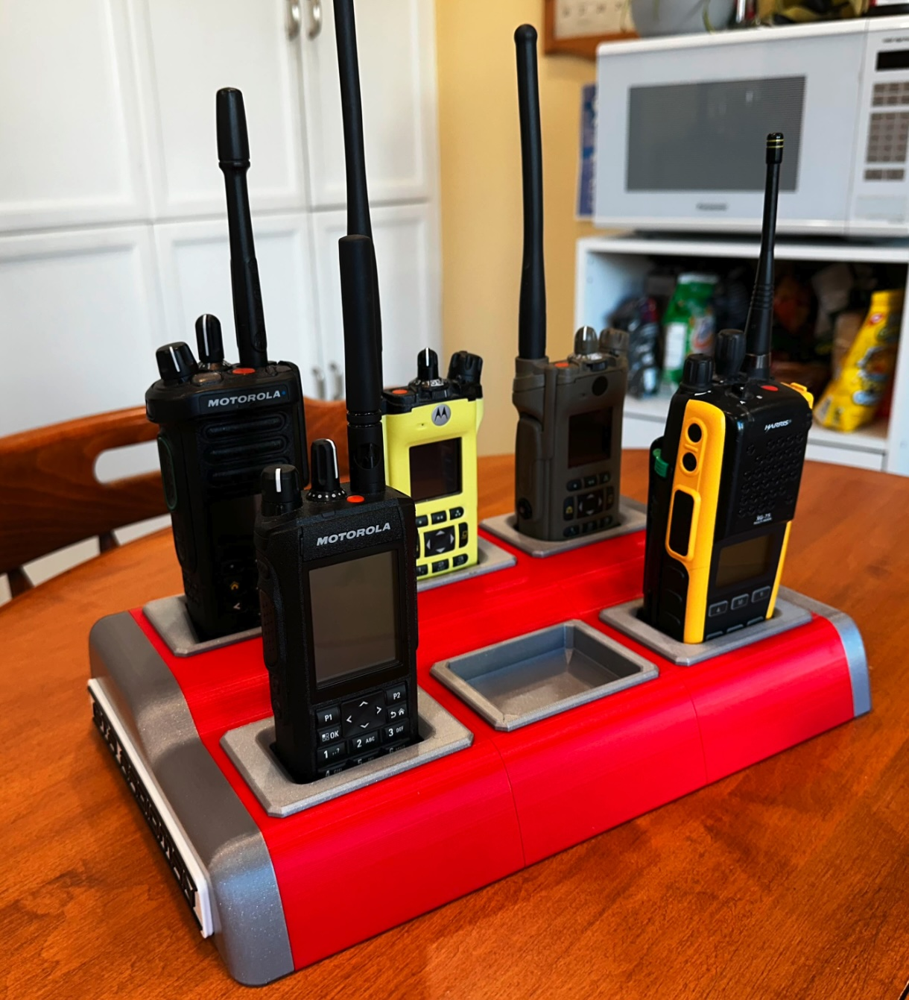

# Overview
Do you like to have your radio on, hearing the infrastructurial heartbeat of the city's busy workers?
Do you not have a tidy and sturdy place to keep your radios while you do so?

This solves for that!

# Features
- elevated rear slot for better access
- depressions in bottom for anti-slip bumpers
- modular design; 
  - 2, 4, 6, 8 - however many radios you want - segments fit together with dowels
  - each radio slot is removable and uses a standard adapter for easy re-modeling
- 'signboard' on each endcap for your own text/logo
- designed for minimal waste in printing; just add glue
