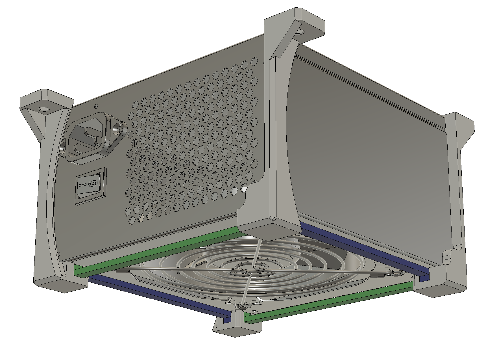
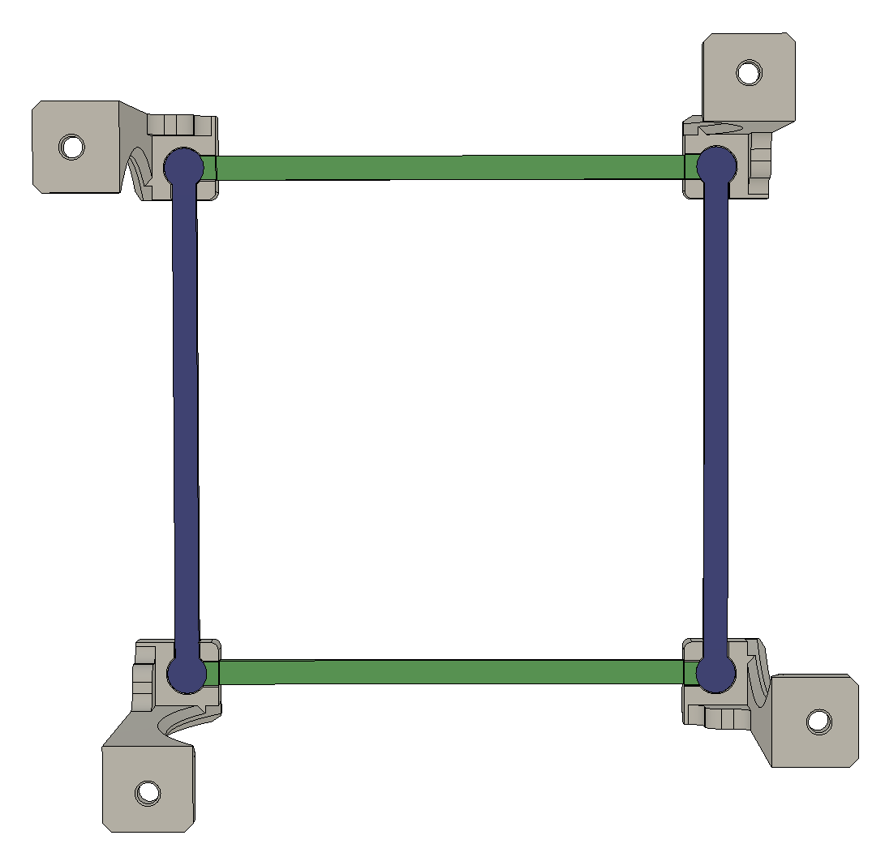
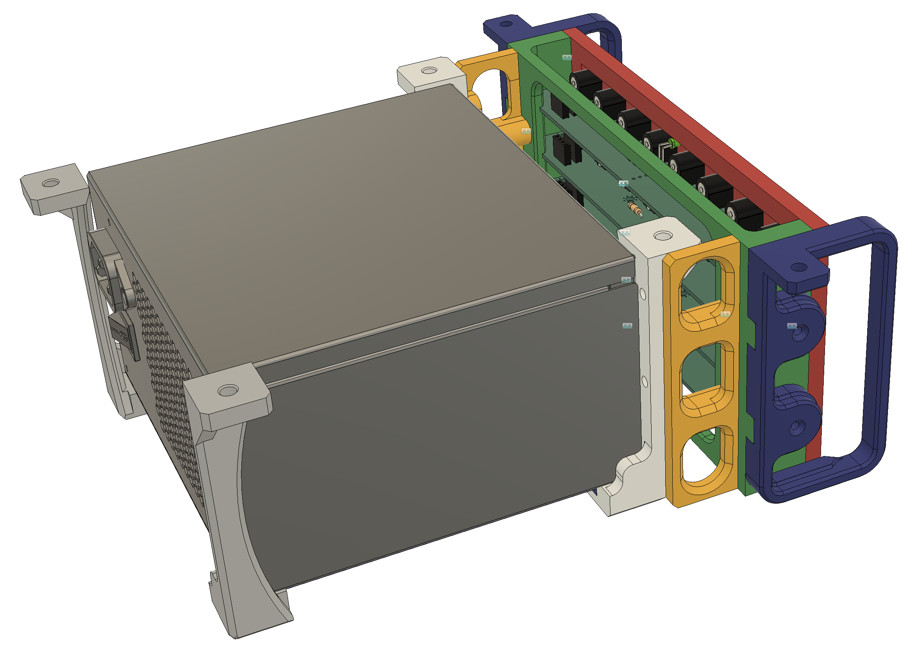
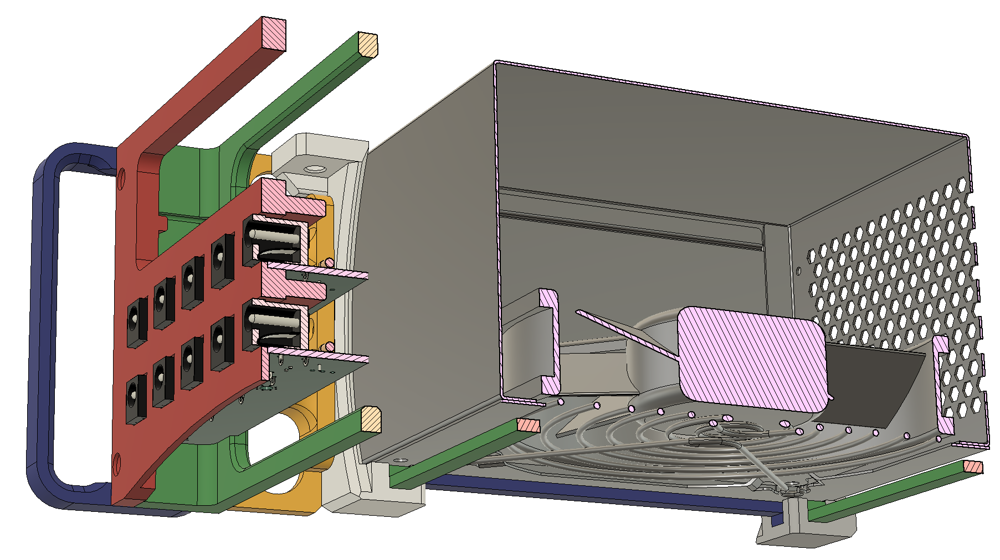

# Overview
I needed a way to mount an ATX power supply to the underside of my desk.  The Fusion `.f3z` file is in the repo if you want to mess around.

For the basic setup, three components:
- vertical bracket
- long-side arm
- short-side arm

Print 4x vertical brackets, 2x of each arm - note every component should be printed flat.  I recommend CA-gluing all the parts in place to make your installation easier.

# PDU version
If you are using the `pdu-inator`: https://github.com/christrotter/simple-pdu-pcb

- You'll need 16-18 m3 hotmelt inserts (_assumes CNCkitchen - 3.9mm dia holes_)
- mirror the 'cable-mgmt-arm-v2.stl' along the x-axis
- only print two of the vertical arms; use the `vertical-bracket` files instead
- pick how many rows - 2 or 4

**NOTE: this is actually a really bad PCB design, as all the voltages are the same connector. Sorry!**

